# THE HINTER GROUP GHANA LTD (HGG LTD)
## Comprehensive Client Review Evaluation & Design Refinement Action Plan

**Based on:** Formal Client Document *`THE HINTER GROUP GHANA LT1.pdf`* (14 Pages, 22 Sections)  
**Client Signoff:** Charles N. Hammond — Chairman & Chief Executive Officer  
**Prepared for:** Shair Shishir — Website Designer & Developer  
**Date:** September 2026  
**Website Preview:** [hintergroup.netlify.app](https://hintergroup.netlify.app)  

---

## 1. Executive Summary & Client Sentiment

The client brief opens with high praise for the work completed to date:
> *"HGG is very pleased with the overall design and direction of the website. The website presents HGG with a professional, sophisticated, modern and international corporate identity. We particularly appreciate the strong use of the HGG navy and gold brand colors, typography, spacing, navigation, visual hierarchy, information architecture, and overall presentation... The overall design, visual identity, organization and functionality have exceeded our expectations."*

### Core Directives from the Client
1. **Preserve the Strong Design Foundation:** This is **not a redesign**. The client insists on preserving the visual identity, navy/gold color palette, typography, card structures, and layout systems already built.
2. **Refinements, Factual Accuracy & Legal Guardrails:** The requested changes focus on legal/regulatory compliance, factual accuracy, framework reconciliation, removing placeholders, and pre-launch QA.
3. **No Over-Engineering or Extra Clutter:** Avoid adding excessive graphics, heavy animations, or unnecessary watermarks.

---

## 2. Complete Section-by-Section Evaluation Matrix

Below is a detailed audit comparing the client's 22 sections against the current website implementation, identifying exact files, status, and required actions.

| # | Client Brief Topic | Current Codebase Status | Evaluation & Required Action | Target Files |
|---|---|---|---|---|
| **1** | **Overall Assessment** | ✅ Approved by Client | Preserve existing layout, typography, navigation, and visual hierarchy. | Site-wide |
| **2** | **Global Visual Direction** | ⚠️ Partially Aligned | • Preserve existing layout without visual clutter.<br>• Introduce subtle low-opacity landmark imagery (`img_new_1.PNG` & `img_new_2.PNG`) selectively.<br>• **Client explicit rule:** Do *not* introduce HGG logo watermark motifs across backgrounds (recently removed chevron arrow is confirmed correct). | `app/*/page.js`, `globals.css` |
| **3** | **Logo & Corporate Name Presentation** | ⚠️ Needs Refinement | On large logo presentations (Footer, Header, About Hero), communicate the 4-tier brand hierarchy:<br>1. **HGG LTD** (Primary)<br>2. **THE HINTER GROUP GHANA LTD** (Subordinate)<br>3. **CONSULTING + VENTURES \| BROKERAGE** (Descriptor)<br>4. **COMMITTED TO EXCELLENCE** (Motto)<br>• Keep mobile navigation clean & uncluttered. | `components/layout/BrandLogo.jsx`, `Navbar.jsx`, `Footer.jsx` |
| **4** | **Home Page Positioning & Copy** | ⚠️ Needs Copy Tuning | • Approved Positioning: *"Connecting Opportunity. Creating Value. Advancing Sustainable Growth."*<br>• Descriptor: *"CONSULTING + VENTURES \| BROKERAGE"*<br>• Motto: *"Committed to Excellence"*<br>• **Critical Guardrail:** Audit all copy to ensure HGG is *never* characterized as directly providing capital, deploying investment funds, or conducting regulated financial/legal/engineering diligence. Reframe to *facilitation, coordination, advisory, and business development*. | `app/page.js`, `components/sections/HeroSection.jsx` |
| **5** | **About Us & Strategic Approach** | ⚠️ Dual Framework Confusion | Primary public methodology must strictly be the **6-Stage Strategic Approach**:<br>`IDENTIFY → EVALUATE → CONNECT → COORDINATE → ADVANCE → CREATE VALUE`.<br>Mission, Vision, and Core Values remain aligned with approved text. | `app/about-us/page.js` |
| **6** | **Leadership Page** | ⏳ Awaiting Client Asset | • Replace temporary Chairman headshot with approved portrait once received from Charles N. Hammond.<br>• Standardize title: **Charles N. Hammond — Chairman & Founder** (or Chairman & CEO per brief).<br>• Ensure zero unverified credentials, degrees, or claims. | `app/leadership/page.js`, Sanity `leadershipMember.js` |
| **7** | **Services / Areas of Expertise** | ⚠️ Needs Legal Qualifier | Verify 7 approved expertise areas:<br>1. Strategic Consulting<br>2. Venture Development & Investment Facilitation<br>3. Brokerage & Business Development<br>4. Strategic Partnership Development & Stakeholder Engagement<br>5. Project Development & Facilitation<br>6. Market Entry & International Business Support<br>7. Research, Market Intelligence & Opportunity Assessment.<br>• Add explicit disclaimer: *Specialist legal, financial, engineering, and technical diligence is conducted in coordination with qualified third-party professional advisers.* | `app/expertise/page.js`, `sanity/schemaTypes/service.js` |
| **8** | **Projects & Confidentiality** | ⚠️ Demo vs. Real Projects | • The 3 current case studies are test/demonstration data.<br>• Add clear badge/label: **"Demonstration Case Study / Indicative Opportunity"** or set to Draft in Sanity so public visitors don't mistake them for closed client transactions before official HGG clearance. | `app/projects-and-partnerships/page.js`, Sanity `project.js` |
| **9** | **"How HGG Serves Your Initiative"** | ⚠️ Tone Adjustment | Ensure 8 engagement roles (Strategic Advisor, Business Development Partner, Venture Facilitator, Brokerage & Intermediary Partner, Stakeholder Coordinator, Investment Facilitator, Partnership Development Partner, Project Development Facilitator) emphasize *facilitating, coordinating, advising, and connecting*, never *guaranteeing* financing or outcomes. | `app/projects-and-partnerships/page.js` |
| **10** | **Responsible Project Development** | ⚠️ Missing Co-adviser Clause | Under Legal Review, Financial Assessment, Technical Evaluation, Regulatory Review, Environmental Review, Commercial Diligence, Risk Analysis:<br>Add note: *"Undertaken by or in coordination with appropriately qualified professional advisers and technical specialists."* | `components/sections/ResponsibleDevelopment.jsx`, `app/projects-and-partnerships/page.js` |
| **11** | **Confidentiality & Discretion** | ✅ Implemented | Retain existing institutional confidentiality section and CMS confidentiality toggles. | `app/projects-and-partnerships/page.js` |
| **12** | **6-Stage vs. 9-Step Pathway** | ❌ Major Action Required | **Client Request:** Remove public references to the "9-Step Project Pathway" (including footer link and hero CTA) in favor of the **6-Stage Strategic Approach**. Reframe or subordinate the 9 steps under Stage 4 (Coordinate) and Stage 5 (Advance) if retained. | `components/layout/Footer.jsx`, `app/projects-and-partnerships/page.js`, `app/page.js`, `DisciplinedPathwaySection.jsx` |
| **13** | **Insights & News Differentiation** | ⚠️ Content Distinction | Distinguish between general thought-leadership articles (infrastructure, energy, agriculture) and official corporate announcements.<br>• Mark any unverified corporate claims (events, conferences, expansion, keynotes) as Draft until Charles N. Hammond provides written signoff. | `app/insights/page.js`, `lib/insightsData.js`, Sanity `article.js` |
| **14** | **Contact Page Stationery Sync** | ⚠️ Placeholders Present | Replace placeholder address (`The Octagon, Accra`) and phone (`+233 30 200 0000`) with approved details from official HGG corporate letterhead/stationery.<br>Sync across Sanity Global Site Settings. | `app/contact/page.js`, `sanity/schemaTypes/siteSettings.js`, `components/layout/Footer.jsx` |
| **15** | **Contact Form Confidentiality Notice** | ❌ Missing | Insert a concise legal notice below the inquiry form stating:<br>1. Do not submit sensitive/proprietary info without an NDA.<br>2. Submitting an inquiry does not establish an advisory, brokerage, fiduciary, or legal relationship. | `app/contact/page.js` |
| **16** | **Footer Audit** | ⚠️ Needs Updates | • Replace "9-Step Project Pathway" link with "6-Stage Strategic Approach".<br>• Ensure all practice areas, sectors, telephone numbers, emails, and legal links reflect final approved stationery. | `components/layout/Footer.jsx` |
| **17** | **Privacy Policy & Terms of Service** | ⚠️ Legal Disclaimer Needed | Add prominent note: *"Subject to final HGG review and legal-counsel approval before formal execution."* Ensure full CMS editing capability. | `app/privacy-policy/page.js`, `app/terms-of-service/page.js` |
| **18** | **CMS / Sanity Administration** | ✅ Guide Delivered | Client will email preferred administrator address for Sanity invite. HGG will receive full administrative ownership at handover. | Sanity Studio (`/studio`) |
| **19** | **Contact Form Email Delivery** | ⏳ Awaiting Client Creds | Client will securely provide corporate SMTP credentials or App Password. Guide client to configure securely via Netlify Environment Variables (`SMTP_USER`, `SMTP_PASS`). | `app/api/contact/route.js`, Netlify Dashboard |
| **20** | **Responsive & Cross-Device Testing** | 🔍 In Progress | Test Windows, macOS, Android, iPhone, iPad across Chrome, Safari, Edge for text wrapping, button tap targets, mobile drawer, and landscape/portrait orientations. | Site-wide |
| **21** | **Pre-Launch Quality Assurance** | 🔍 In Progress | Complete checklist: SEO meta tags, OpenGraph previews, Favicon verification, SSL/HTTPS, 404 page handling, form error validation. | Site-wide |
| **22** | **Client Relationship & Final Signoff** | 🤝 Aligned | High client trust and appreciation. Deliver refined updates with professional commentary. | Communication |

---

## 3. High-Priority Action Items (Ranked by Urgency)

### Priority 1: 6-Stage Strategic Approach vs. 9-Step Project Pathway (Section 12 & 16)
* **Issue:** The site currently promotes both frameworks simultaneously, which confuses external investors and partners.
* **Client Instruction:** The **6-Stage Strategic Approach** (`IDENTIFY → EVALUATE → CONNECT → COORDINATE → ADVANCE → CREATE VALUE`) must be the primary public-facing methodology.
* **Concrete Actions:**
  1. In `components/layout/Footer.jsx`: Replace `"9-Step Project Pathway"` link with `"6-Stage Strategic Approach"`.
  2. In `app/projects-and-partnerships/page.js`: Update the hero CTA button from `9-Step Pathway` to `Our Approach` or `Strategic Approach` linking to `#strategic-approach`.
  3. In `app/page.js` & `components/sections/DisciplinedPathwaySection.jsx`: Position the 9-Step framework as the *operational project execution mechanism* nested within Stages 4 & 5 of the 6-Stage Approach, or transition the section header to highlight the 6-Stage Strategic Methodology.

### Priority 2: Legal & Regulatory Language Alignment (Sections 4, 7, 9, 10)
* **Issue:** Regulatory bodies (e.g., Ghana SEC, Bank of Ghana) regulate fund management, deposit-taking, and licensed engineering/legal practice. The website must protect HGG from regulatory exposure.
* **Client Instruction:** Ensure HGG is positioned strictly as a facilitator, advisor, and coordinator.
* **Concrete Actions:**
  1. Add disclaimer under **Responsible Project Development** (`app/projects-and-partnerships/page.js`):
     > *"Specialist reviews—including legal diligence, regulatory compliance, technical feasibility, and financial modeling—are conducted by or in structured coordination with appropriately qualified third-party professional advisers and technical specialists."*
  2. Audit service descriptions in `app/expertise/page.js` and `app/page.js` to ensure terms like "financing guaranteed" or "direct capital deployment" are replaced with "investment facilitation", "capital introduction", and "strategic syndicate structuring".

### Priority 3: Contact Form Confidentiality Notice (Section 15)
* **Issue:** Prospective partners may submit confidential project proposals or pitch decks without prior NDA protection, creating legal liabilities.
* **Client Instruction:** Add a concise, unobtrusive notice near the inquiry form.
* **Concrete Action:** Add the following notice right above or below the submit button in `app/contact/page.js`:
  ```jsx
  <div className="p-3 bg-slate-50 border border-slate-200 rounded-md text-[11px] text-slate-500 leading-relaxed space-y-1">
    <p>
      <strong>Confidentiality Notice:</strong> Please do not submit confidential, proprietary, privileged, or commercially sensitive information through this general inquiry form unless an executed non-disclosure agreement is in place.
    </p>
    <p>
      Submitting an inquiry through this website does not, by itself, establish a client, advisory, brokerage, fiduciary, or legal relationship with THE HINTER GROUP GHANA LTD.
    </p>
  </div>
  ```

### Priority 4: Project Case Studies & Insights Disclaimers (Sections 8 & 13)
* **Issue:** The 3 current projects (e.g., *Tema Logistics Corridor, Volta Basin Agri-Tech, Accra Western Bypass*) and 18 Insights articles are demonstration content.
* **Client Instruction:** Prevent public visitors from interpreting test data as active HGG corporate engagements.
* **Concrete Actions:**
  1. Add an indicative badge to project cards on `/projects-and-partnerships`: `"Indicative Project Profile / Sector Opportunity"` or ensure Sanity allows drafting them.
  2. Review the 18 Insights articles in `lib/insightsData.js` and Sanity: Ensure articles are categorized under *Sector Analysis & Thought Leadership* rather than claiming specific unverified corporate deals or keynote appearances.

### Priority 5: HGG Logo 4-Tier Hierarchy (Section 3)
* **Issue:** Larger brand representations should communicate the full corporate stature.
* **Client Instruction:** Where space permits, display:
  1. **HGG LTD** (Bold primary)
  2. **THE HINTER GROUP GHANA LTD** (Subordinate)
  3. **CONSULTING + VENTURES | BROKERAGE** (Descriptor)
  4. **COMMITTED TO EXCELLENCE** (Motto)
* **Concrete Action:** Enhance `components/layout/BrandLogo.jsx` and footer brand block so desktop/large sizes showcase this elegant 4-tier typographic hierarchy while mobile remains compact and legible.

### Priority 6: Corporate Stationery Contact Synchronization (Sections 14 & 16)
* **Issue:** Placeholder addresses and phone numbers remain on the development site.
* **Client Instruction:** Update with final official contact info from HGG letterhead.
* **Concrete Action:** Once the user/client provides the exact phone number and street address from official stationery, update `siteSettings` in Sanity and the fallback defaults in `app/contact/page.js` and `components/layout/Footer.jsx`.

---

## 4. Recommended Step-by-Step Implementation Roadmap

```mermaid
flowchart TD
    A[Review Client Brief] --> B[Phase 1: Legal & Governance Guardrails]
    B --> B1[Add Contact Form Confidentiality Notice]
    B --> B2[Add Professional Diligence Co-adviser Disclaimer]
    B --> B3[Add Indicative Project Badges]
    
    A --> C[Phase 2: Framework Reconciliation]
    C --> C1[Reconcile 6-Stage Approach as Primary]
    C --> C2[Update Footer Link & Hero Buttons]
    C --> C3[Integrate 9-Step Pathway into Stage 4 & 5]
    
    A --> D[Phase 3: Brand & Typographic Polish]
    D --> D1[Enhance 4-tier Logo Hierarchy for Large Displays]
    D --> D2[Apply Subtle Faded Landmark Backgrounds]
    D --> D3[Confirm Zero Logo Watermarks]
    
    A --> E[Phase 4: Client Handover & Launch Preparation]
    E --> E1[Sanity User Invitation for HGG Administrator]
    E --> E2[Secure SMTP Configuration via Netlify Env]
    E --> E3[Replace Placeholder Phone/Address with Stationery]
    E --> E4[Cross-Device QA & Browser Testing]
```



---

## 5. Summary Message for WhatsApp / Client Communication

You can send this polished message directly to Charles N. Hammond:

> **Dear Mr. Hammond,**  
>  
> Thank you very much for the comprehensive 14-page review brief (*THE HINTER GROUP GHANA LT1.pdf*). We are truly honored that the design, visual identity, navigation, and corporate aesthetic have exceeded HGG's expectations.  
>  
> We have conducted a complete audit of the website against all 22 sections of your brief. Here is our direct action plan:  
>  
> 1. **Framework Alignment:** We are establishing the **6-Stage Strategic Approach** (*Identify → Evaluate → Connect → Coordinate → Advance → Create Value*) as the definitive public methodology throughout the site, navigation, and footer.  
> 2. **Legal & Governance Guardrails:** We are inserting the requested **Contact Form Confidentiality & Non-Engagement Notice** and clarifying that specialist diligence (legal, financial, engineering) is conducted in structured coordination with qualified external professional advisers.  
> 3. **Demonstration Transparency:** Current project case studies and thought-leadership insights will be clearly badged as indicative sector opportunities to maintain complete corporate transparency.  
> 4. **Brand Presentation:** We are enhancing the 4-tier corporate logo hierarchy (*HGG LTD / THE HINTER GROUP GHANA LTD / CONSULTING + VENTURES \| BROKERAGE / COMMITTED TO EXCELLENCE*) for high-impact desktop displays while keeping mobile navigation fast and clean.  
> 5. **Stationery & Admin Handover:** As soon as you share the official letterhead details and your preferred administrator email, we will synchronize the live Sanity CMS and configure the secure SMTP email delivery.  
>  
> We look forward to delivering these pre-launch refinements for your final review.  
>  
> *Warm regards,*  
> **Shair Shishir**
